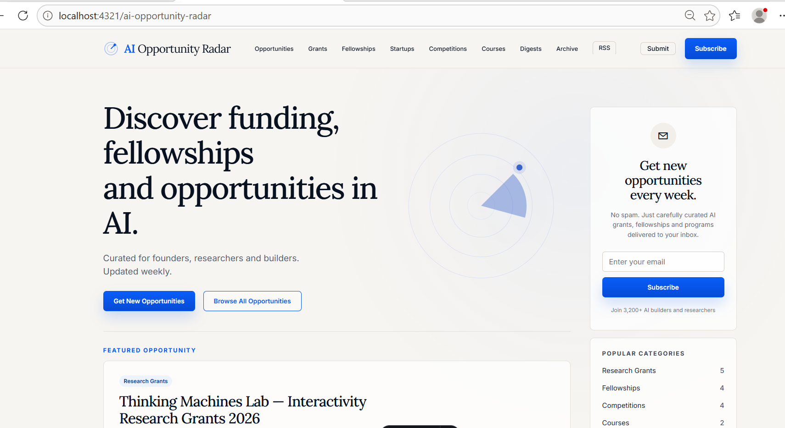
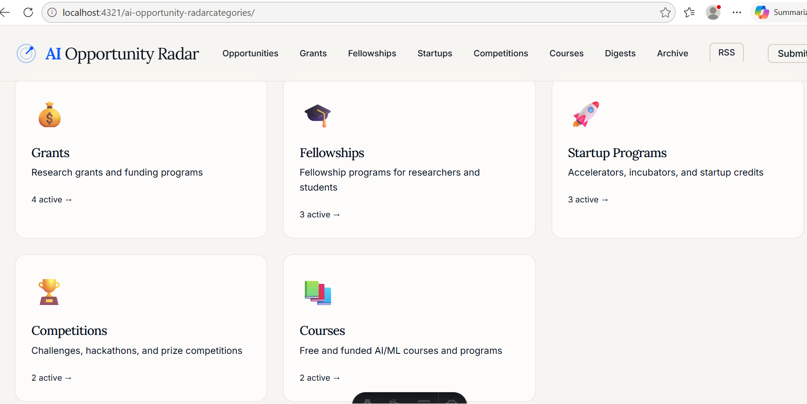
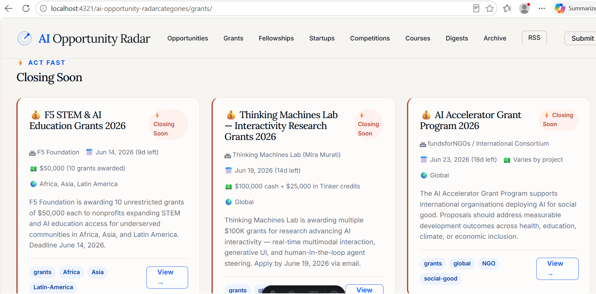
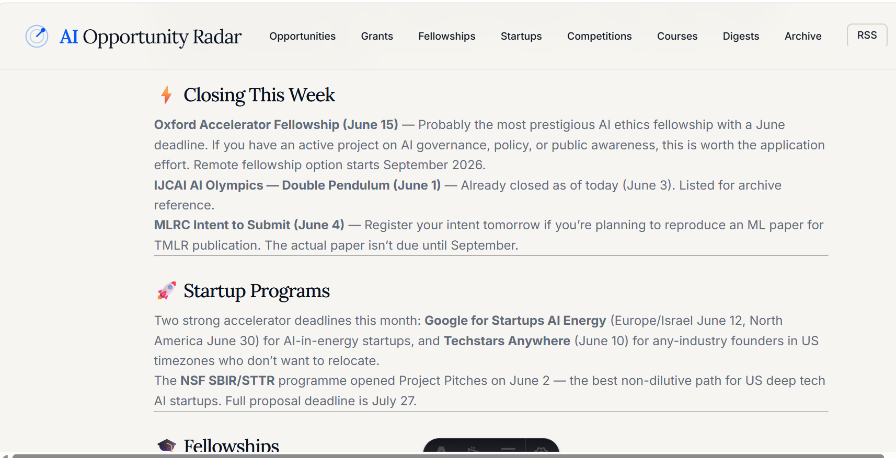

# AI Opportunity Radar

> You found out about the opportunity three days after the deadline.
> **AI Opportunity Radar fixes that.**

One place to discover active AI grants, fellowships, accelerators, competitions, scholarships, courses, and learning opportunities — reviewed and updated before deadlines expire.


**⭐ If this saves you time, star the repo — it helps more builders, students, founders, and researchers find it.**

---

AI Opportunity Radar helps researchers, students, founders, and builders discover AI opportunities before deadlines expire.

Instead of monitoring dozens of university websites, accelerator programs, research labs, foundations, and community announcements, you can browse a single curated directory of grants, fellowships, startup programs, competitions, scholarships, and learning opportunities.

Every listing links to an official source and is organized to make opportunity discovery faster, simpler, and more reliable.

---
## What You Get

- **Active opportunities only** — expired listings are archived instead of cluttering the site
- **Closing soon alerts** — near-deadline opportunities are clearly flagged
- **Weekly digest** — a curated shortlist of new and important opportunities
- **RSS feed** — subscribe once and keep up with updates automatically
- **Five core categories** — Grants, Fellowships, Startup Programs, Competitions, Courses
- **Archive pages** — past opportunities remain searchable for reference

---

## Why People Use It

Instead of checking dozens of websites, readers can:

- discover opportunities earlier
- track deadlines in one place
- find grants and fellowships without repeated manual searching
- monitor startup programs and accelerator windows
- browse weekly curated selections
- subscribe through RSS and return when new opportunities are added

**The goal is simple: spend less time searching and more time applying.**

---
## Live Site

**[preetharaj.github.io/ai-opportunity-radar](https://preetharaj.github.io/ai-opportunity-radar)**

---

## Never Miss a Deadline

Subscribe via RSS — works in Feedly, Reeder, NetNewsWire, or any feed reader:

https://preetharaj.github.io/ai-opportunity-radar/feed.xml

New opportunities are added through weekly updates. Closing-soon items are clearly highlighted.

---

## This Week's Radar

Current opportunities include:

- 💰 **Thinking Machines Lab Interactivity Grants** — $100K + $25K credits · Closes Jun 19
- 🎓 **Oxford AI Ethics Accelerator Fellowship** — Funded · Closes Jun 15
- 🚀 **Google for Startups AI Energy Accelerator** — $350K cloud credits · Closes Jun 12
- 📚 **AWS AI & ML Scholars** — Free · 100,000 global scholarships · Closes Jun 24
- 🏆 **MLRC Reproducibility Challenge** — TMLR publication · Closes Jun 4

[→ View all active opportunities](https://preetharaj.github.io/ai-opportunity-radar)

---

## Who This Is For

| If you are... | You'll find... |
|---|---|
| AI/ML researcher | Grants, fellowships, research funding |
| Solo founder or indie builder | Accelerators, cloud credits, startup programs |
| Student or early-career | Scholarships, courses, competitions |
| Anyone building with AI | Competitions, hackathons, open calls |

---

---

## Quick Start

```bash
# Clone
git clone https://github.com/PreethaRaj/ai-opportunity-radar.git
cd ai-opportunity-radar

# Install
npm install

# Copy env file (leave UMAMI ID blank for local dev)
cp .env.example .env

# Launch — opens browser automatically
bash start.sh        # Mac/Linux
start.bat            # Windows
```

Or manually:

```bash
npm run dev
# → http://localhost:4321/ai-opportunity-radar
```

---

## Screenshots

Add screenshots after deployment:

### Homepage



### All Categories



### Grants Page



### Weekly Digest Page



### Demo Walkthrough


---
## Found an Opportunity We Missed?

[Open an issue →](https://github.com/PreethaRaj/ai-opportunity-radar/issues/new?template=submit_opportunity.md&title=%5BOpportunity%5D+Your+Title+Here)
It takes 2 minutes. Include the official source URL and deadline.

All submissions are verified before publication.

---

## FAQ

**How do I know deadlines are accurate?**
Every listing links to an official source. We verify deadlines before publishing and do not list unverified opportunities.

**What if I miss a week?**
All past digests are archived at [/digests/](https://preetharaj.github.io/ai-opportunity-radar/digests/). Subscribe to RSS to never miss one.

**How often is it updated?**
Weekly.

**Is this free?**
Yes. No login, no paywall, no ads. Subscribe via RSS or bookmark the site.

**Can I contribute?**
Yes — open an issue with an opportunity you think belongs here. See above.

---

## Developer Setup

## Prerequisites

- Node.js 18+
- npm
- Git
- GitHub account

Verify:

```bash
node --version   # must be v18+
npm --version
git --version
```

## Build

```bash
npm run build
```

## Archive Expired Opportunities

```bash
# Dry run — shows what would change
node scripts/archive-expired.mjs

# Apply changes
node scripts/archive-expired.mjs --write
```

## Add a New Opportunity

```bash
node scripts/new-opportunity.mjs
```

Scaffolds a Markdown file with all required fields. Fill in the REPLACE fields from the official source and push.

Each opportunity is a single Markdown file with frontmatter:

```yaml
title: "Opportunity Title"
provider: "Organisation"
category: "grants"
deadline: "2026-08-01"
amount: "$50,000"
region: "Global"
eligibility: "Who can apply"
summary: "One sentence description"
applyLink: "https://..."
sourceLink: "https://..."
publicationDate: "2026-06-03"
status: "active"   # active | closing-soon | archived
tags: ["grants", "global"]
```

## Analytics

Analytics use [Umami](https://umami.is) 

Events tracked:
- `homepage-view`
- `category-page-view`
- `opportunity-detail-view`
- `opportunity-click`
- `rss-click`
- `newsletter-signup-click`
- `submit-opportunity-click`
- `subscribe-click`

---

## Support The Project

If AI Opportunity Radar helped you discover an opportunity:

- ⭐ star the repository
- 🔄 share it with a friend, student, founder, or researcher
- 📢 submit opportunities we missed
- 🧭 check back weekly for new updates

Together, we can make it easier for the AI community to find useful opportunities before deadlines disappear.

---
MIT License · Built with [Astro](https://astro.build) · Deployed on [GitHub Pages](https://pages.github.com)
